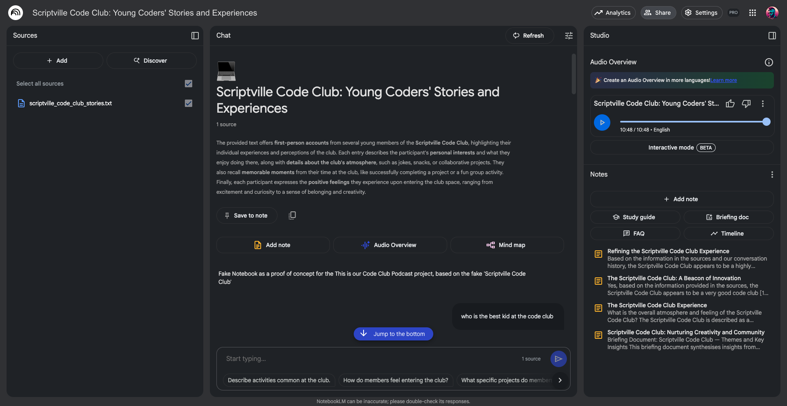

This project is part of 'This is our Code Club' — a campaign from the Raspberry Pi Foundation to help every Code Club in the UK share its story. The goal is to generate a creative, personal artefact — a podcast episode — using a large language model (LLM) called **NotebookLM**. 

## What you will do

Your creators will reflect on what Code Club means to them. You’ll collect their stories, then feed these stories into NotebookLM as `.txt` files. The LLM will then generate an authentic-sounding podcast using your creators' names and reflections — something that feels polished, personal, and shareable.

Your creators can find the project resources with instructions and writing prompts on the Code Club projects site at [rpf.io/ccpodcast](http://rpf.io/ccpodcast){:target="_blank"}. 

In the middle of the project, while you wait for the LLM to generate the podcast audio, an unplugged activity is provided that gives creators an insight into how the concept of 'temperature' (how exotic an LLM's vocabulary becomes) affects the output of generative artificial intelligence (AI) systems.

### Data protection and safeguarding

**NotebookLM** (Google Labs) works with your uploaded documents but **does not** train on them or share them externally. Still, safeguarding is your responsibility as a club leader.

**Your responsibilities:**
* Use **first names only**  
* Remove addresses, location data, and personal contact info  
* Review and clean up all `.txt` files before uploading

--- task ---

Interact with a pre-made example based on the fictional Scriptville Code Club at [rpf.io/scriptvillecc](http://rpf.io/scriptvillecc){:target="_blank"}.

--- /task ---

--- no-print ---

--- task ---

Listen to an example podcast about the fictional Code Club here:

<audio controls style="width:100%;max-width:448px;">
  <source src="images/ccpodcast.mp3" type="audio/mpeg">
  Your browser doesn’t support the <code>&lt;audio&gt;</code> element —
  <a href="images/ccpodcast.mp3">download the file instead</a>.
</audio>

--- /task ---

--- /no-print ---

### You will need:
- Internet connection
- Access to text editor software (local or online)
- An email or Google credentials (to sign in to NotebookLM)

**For the unplugged activity:**
- 6-sided dice ([or make your own from paper here](resources/dice.pdf){:target="_blank"})
- Pencils
- Creator handouts ([available here](resources/LLMStorytime_creator.pdf){:target="_blank"})
- Leader handout ([available here](resources/%20LLM%20Storytime_leader.pdf){:target="_blank"})
