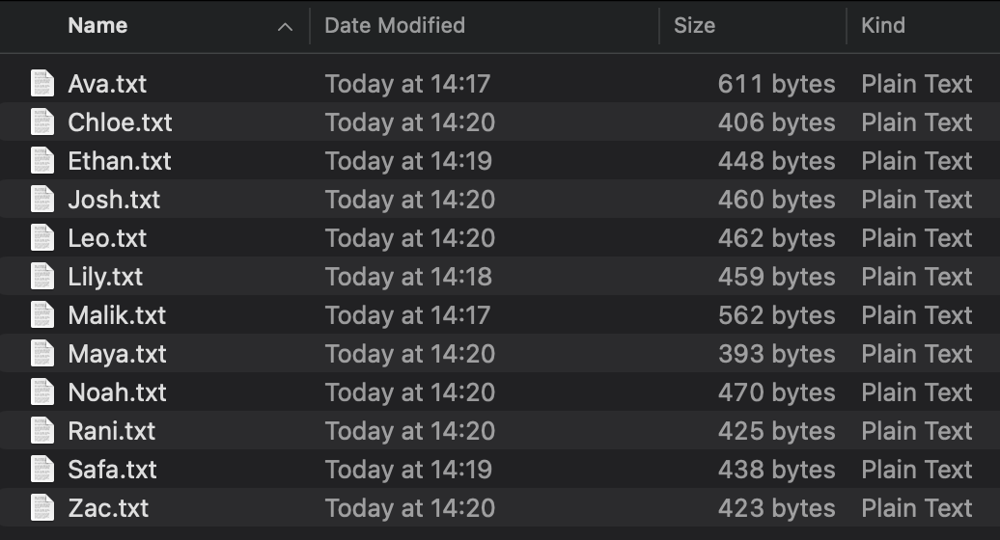

## Support Creator Writing
Great AI outputs depend on strong source inputs. Your job is to help your coders express themselves naturally and clearly.

You can pre-select a few of the writing prompts on this page, or just let your creators choose the ones that inspire them the most.

--- task ---

Support your creators to open the text editing software for your operating system:

Choose your device to find out how to open a plain text editor on your computer:

--- collapse ---
---
title: I'm using macOS
---

Click on the magnifying glass in the top-right corner of your screen and type `TextEdit`. Open the app.

Then go to the menu bar at the top and click:

**Format > Make Plain Text**  
(or press `Shift + Command ⌘ + T`)

You're ready to type!
--- /collapse ---

--- collapse ---
---
title: I'm using Windows
---

Click the Start menu and search for `Notepad`. Open the app.

You're ready to type!
--- /collapse ---

--- collapse ---
---
title: I'm using Linux
---

Open the application menu and search for `Leafpad` or `Gedit`.

If your device doesn’t have these apps installed, you can use a website like [https://editpad.org](https://editpad.org) — just remember to download your file as `.txt` when you’re done.

You're ready to type!
--- /collapse ---

--- collapse ---
---
title: I'm using ChromeOS
---

1. Click the **Launcher** (circle icon in the bottom-left corner)
2. Type `Text` in the search bar
3. Open the **Text** app (it’s the default plain text editor)

If your device doesn’t have the Text app installed, you can use a website like [https://editpad.org](https://editpad.org) — just remember to download your file as `.txt` when you’re done.

You’re ready to type!
--- /collapse ---

--- /task ---


### Writing prompts:

--- task ---

Choose a few of these prompts for your creators to use:

- What’s the coolest thing you’ve ever made in our Code Club?  
- What makes our Code Club different from any other?  
- If our Code Club had a motto or catchphrase, what would it be and why?  
- Who are the characters in our club story? (people, inside jokes, traditions, mascots)  
- What’s one day in Code Club that stands out? Why?  
- If you were introducing our Code Club to someone on a podcast, what story would you tell?  
- How do you feel when you walk into our Code Club space?

--- /task ---

--- task ---

Using the chosen text editor software, each creator answers 2-3 of the [project](http://rpf.io/ccpodcast) prompts and types their answers into a `.txt` file.  

**What works best for prompted writing:**
* Short personal reflections or anecdotes
* Informal, natural tone (like they’re talking, not writing an essay - tips on text-to-speech tools below)  
* Specific stories or club moments  
* Fun, expressive, weird - whatever reflects your club and creators best

--- /task ---

### Speech-to-text support

You can use free, no sign-up online tools to transcribe creator’s speech, like:

* [Galaxy.ai](https://galaxy.ai/ai-transcription)  
* [Evernote](https://evernote.com/ai-transcribe)

Paste the output of these tools into your creators’ text files for a more natural and conversational (but definitely louder!) club session.

### Processing student `.txt` files:

--- task ---

Make sure that your creators have everything they need in their `.txt` files before saving them.

**Each document should have:**
* Creators’ first names  
* An ‘About me’ section (no identifying information)  
* 2 or 3 personal writing answers using prompts

--- /task ---

---

**Example txt file:**

```
First name: Ava

About me:  
I’ve been coming to Scriptville Code Club for about six months. I like 
building games in Scratch and helping other people when they’re stuck.

Our Code Club:  
We always start with a joke from our leader. There’s usually biscuits. 
I sit next to Theo and we try to outdo each other’s projects.

A day I remember:  
One time I accidentally deleted my project and had to rebuild it from 
memory. It ended up better than the original. I showed my grandma and 
she said it was brilliant!

When I walk into our club space: 
I feel excited and happy, like something fun is about to happen.
```

---


--- task ---

Save each file with the creator’s first name: `ava.txt`. 

(You could also combine all student stories into one `codeclub_reflections.txt` file, if it's easier for you.)

--- /task ---

--- task ---

Collect all the files into one folder, ready to upload to NotebookLM.


--- /task ---


