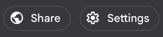
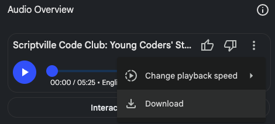

## Use NotebookLM
Upload your creators' writing to NotebookLM and generate the podcast audio.

### Build Your NotebookLM Knowledge Base

--- task ---

Go to [notebooklm.google.com](http://notebooklm.google.com){:target="_blank"} (free with email address or google login)

--- /task ---

--- task ---

Create a **new notebook**.

--- /task ---

--- task ---

Upload the collected `.txt` files in the popup window.

--- /task ---

That’s your **knowledge** **base** created; the collection of writing from your creators. Now the LLM will analyse the writing and create an audio overview to your specifications.

### Customise the Podcast 

--- task ---

Before generating the podcast, click the **black 'Customise'** button:  

--- /task ---

--- task ---

Choose your **Length**: `Shorter`(5-7min), `Default`(10-12min), or `Longer`(15-20min)  

--- /task ---

--- task ---

Use the input box to guide the AI in creating the audio.   
   Paste this prompt:

   *Create a fun, inspiring podcast introducing our Code Club and telling its story from the perspective of our young creators. Use the first names and stories from the uploaded documents to give it personal touches and details. Keep it friendly and natural. Don’t make anything up: \*only\* use the source material.*

--- /task ---

--- task ---

Click **Generate**.

--- /task ---

NotebookLM will output a two-voice podcast discussion based on your students’ reflections. While you wait, ask the LM some questions about the writing, or click one of the note generation buttons at the bottom right to get some interesting textual insights:  
  

---

## **Share your podcast**

Once your podcast episode has been generated in NotebookLM, it’s time to share it!

NotebookLM lets you share your finished notebook (including the podcast) using a public link. This means that anyone with the link can ask questions about your code club to the LLM and get a response based on your creators’ words, or listen to your podcast\! 

--- task ---

Click the **Share** button at the top of the notebook:

--- /task ---

--- task ---

Choose **Anyone with the link can view** under **Notebook Access** to make it accessible: 

--- /task ---

--- task ---

Copy and send the link to friends, family, your school, or even share it on social media. (Try making it a bit easier to read using a free service like [TinyURL](https://tinyurl.com/){:target="_blank"}.)

--- /task ---

--- task ---

Send the link to us to have your work shared with the global Code Club community!

--- /task ---

### Download your podcast

--- task ---

You can also download the podcast audio as a `.wav` file. 

--- /task ---

This makes it easy to upload to your club or school website or YouTube channel, play it in assembly or at home, or keep a copy as a digital souvenir of your Code Club. Tag us on social media if you share your podcast - we’d love to see and share it!

Whether it’s a private keepsake or something you want to show the world, your AI-generated podcast is a celebration of your Code Club!  

---

## Final Checklist

--- task ---

Student reflections written  

--- /task ---
--- task ---

Text files checked (first name only, no identifiers, no rude words) 

--- /task ---
--- task ---

Saved as .txt with creator first names in filename, all in the same folder 

--- /task --- 
--- task ---
 
 Text files uploaded to NotebookLM  

--- /task ---
--- task ---

Podcast generated using Customise panel and prompt  

--- /task ---
--- task ---

Podcast audio reviewed / shared

--- /task ---
