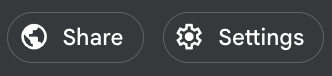
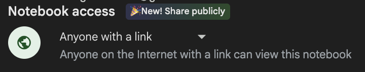
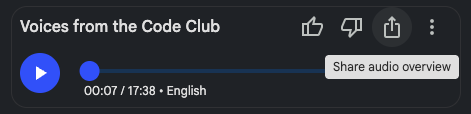
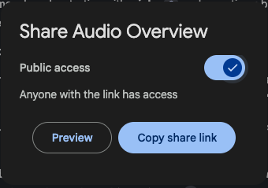
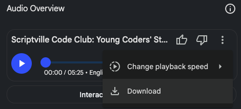

## **Share your podcast**

<html>

<iframe style="position: absolute; top: 0; left: 0; right: 0; width: 100%; height: 100%; border: none;" src="https://www.youtube.com/embed/jU_Z4PWc_Ks?rel=0&cc_load_policy=1" allowfullscreen allow="accelerometer; autoplay; clipboard-write; encrypted-media; gyroscope; picture-in-picture; web-share">
</iframe>

 
</html>

Once your podcast episode has been generated in NotebookLM, it’s time to share it!

NotebookLM lets you share your finished notebook (including the podcast) using a public link. This means that anyone with the link can ask questions about your code club to the LLM and get a response based on your creators’ words, or listen to your podcast\! 

--- task ---

Click the **Share** button at the top of the notebook:

--- /task ---

--- task ---

Choose **Anyone with the link can view** under **Notebook Access** to make it accessible: 

--- /task ---

You can also share the Audio Overview alone, without access to the NotebookLM. 

--- task ---

Click the **share** button to the right of your podcast title and the like/dislike buttons:

--- /task ---

--- task ---

In the popup that appears, make sure the toggle is set to 'on':

From here you can **Preview** the audio and what others will see, or copy the link for sharing.

--- /task ---

--- task ---

Copy and send the links to friends, family, your school, or even share it on social media! 

**Tip:** Try making it a bit easier to read and share by using a free URL shortening service like [TinyURL](https://tinyurl.com/){:target="_blank"}.

--- /task ---

--- task ---

Send the link to us to have your work shared with the global Code Club community!

--- /task ---

### Download your podcast

--- task ---

You can also download the podcast audio as a `.wav` file. 

--- /task ---

This makes it easy to upload to your club or school website or YouTube channel, play it in assembly or at home, or keep a copy as a digital souvenir of your Code Club. Tag us on social media if you share your podcast - we’d love to see and share it!

Whether it’s a private keepsake or something you want to show the world, your AI-generated podcast is a celebration of your Code Club!  

---

## Final Checklist

--- task ---

Student reflections written  

--- /task ---
--- task ---

Text files checked (first name only, no identifiers, no rude words) 

--- /task ---
--- task ---

Saved as .txt with creator first names in filename, all in the same folder 

--- /task --- 
--- task ---
 
 Text files uploaded to NotebookLM  

--- /task ---
--- task ---

Podcast generated using Customise panel and prompt  

--- /task ---
--- task ---

Podcast audio reviewed / shared

--- /task ---
