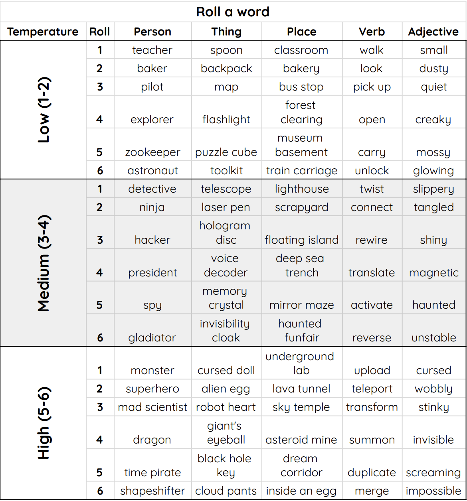

## Unplugged activity: LLM storytime

While you wait for the LLM to create your new podcast, play a fun unplugged game with your creators where they use dice to make crazy stories, and learn a little bit about how LLMs create sentences.

The creator handout is [available here as a printable PDF](resources/LLMStorytime_creator.pdf){:target="_blank"}, and a printable PDF for running the unplugged activity with discussion prompts is [available here](resources/LLMStorytime_leader.pdf).

### **Overview:**

You're training an AI system called an **LLM** that uses your stories to answer questions, and make a podcast with AI voices. But an LLM like NotebookLM doesn’t actually think, or understand *anything*: it just guesses what should come next in a sentence.

The higher the 'temperature' set for the LLM, the wilder its guesses get. Your creators will now use dice rolls to generate a story like an LLM and control the story's **temperature**!

### **Your creators will need:**
- 6-sided dice ([or make your own from paper here](resources/dice.pdf){:target="_blank"})
- Pencils
- Creator handouts ([available here](resources/LLMStorytime_creator.pdf){:target="_blank"})

### Generate a story like an LLM

--- task ---

**Set the temperature**

First, creators roll a die. Their result will determine which part of the word table they'll use to create their stories:

**1–2** \= Low (predictable and safe)  
**3–4** \= Medium (balanced and interesting)  
**5–6** \= High (random and wild)

--- /task ---

### Generate a story

  In a [<strong>adjective</strong>] [<strong>place</strong>], 
  a [<strong>person</strong>] found a 
  [<strong>adjective</strong>] [<strong>thing</strong>]. 
  Curious, they tried to [<strong>verb</strong>] it, 
  but that only made things [<strong>adjective</strong>]. 
  Moments later, something [<strong>adjective</strong>] happened 
  when a [<strong>adjective</strong>] [<strong>person</strong>] 
  appeared and had to [<strong>verb</strong>] it immediately!

--- task ---
Next, creators roll a die for each bracketed word above, and look up words in the table below. 
Their result determines the row (1–6) from the table. Higher rolls \= stranger words.
--- /task ---

###  Word table

--- task ---

Once your creators have all generated a story or two, move on to the discussion section.

--- /task ---

### Discussion

--- task ---

**Ask: What’s the weirdest verb (doing word) you can think of?🤔**

It’s pretty hard to do! Take some examples and ask: "What makes it *weird*?"

--- /task ---

--- task ---

**Ask: "Who would like to share a low-temperature story?"**

Take examples of low-temperature stories. Note how normal the inserted words are. The stories probably won’t be too crazy.

--- /task ---

--- task ---

**Ask: "Who would like to share a medium-temperature story?"** 

Take examples of medium-temperature stories. Note how the inserted words are a bit more interesting. The story probably sounded like it might be interesting if we used it as a prompt for something bigger.

--- /task ---

--- task ---

**Ask: Who would like to share a high-temperature story?"** 

Take examples of high-temperature stories. Note how weird the inserted words are. The stories probably won’t make a lot of sense, and could be really crazy.

--- /task ---

--- task ---

**Ask: "How does temperature affect the story our pretend LLM generated?"** 

When you talk about the temperature of an LLM like ChatGPT, what you’re really talking about is how random and strange the words it will use are. Lower temperature means it will use more likely and normal words in its output, while higher temperature means weirder, less likely words.

--- /task ---

By now, your creators' AI-generated podcast should be ready to listen to! 

In the next step, find out how to share the podcast with your creators, or whomever you like!
